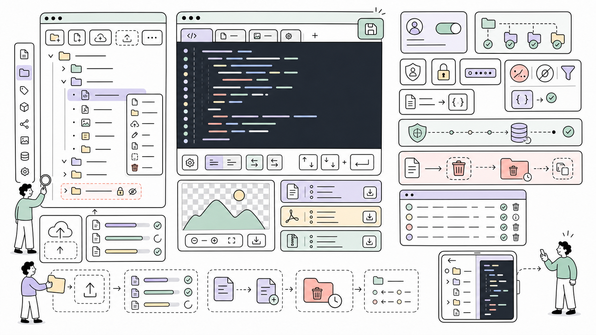

# Editor

ProcessWire module that adds a file manager and code editor to the admin.
Browse, create, edit, rename, and delete files in `/site/templates/`
(and optionally `/site/modules/`) without leaving the browser.

**Repository:** [github.com/mxmsmnv/Editor](https://github.com/mxmsmnv/Editor)  



**Author:** Maxim Semenov  
**Website:** [smnv.org](https://smnv.org)  
**Email:** [maxim@smnv.org](mailto:maxim@smnv.org)

If this project helps your work, consider supporting future development: [GitHub Sponsors](https://github.com/sponsors/mxmsmnv) or [smnv.org/sponsor](https://smnv.org/sponsor/).  
**License:** MIT

---

> **Disclaimer**  
> This module provides direct read/write access to your site's template and module files
> from the browser. Use it only on servers you control, with HTTPS enabled, and restrict
> access to trusted superusers. The author accepts no responsibility for data loss,
> security incidents, or site breakage caused by improper use. Always maintain backups
> before editing production files. **Do not install on shared hosting environments
> where other users may gain admin access.**

---

## Features

**File tree**
- Collapsible tree with lazy directory loading per folder
- Heroicons 2.2 inline SVG — no external icon dependencies
- Chevrons with smooth rotation, depth-aware indentation
- The Editor module directory itself is always hidden and protected

**Editor**
- CodeMirror 5.65.16 bundled locally — no CDN, works offline
- Syntax highlighting: PHP, JS, CSS, HTML, JSON, XML, Markdown
- Dracula theme, line numbers, tab indentation, monospace font
- Save with **Save** button or **Ctrl+S** / **Cmd+S**
- No false "unsaved changes" prompt on file open

**File operations**
- Create file or folder — button in sidebar or **Ctrl+N** / **Cmd+N**
- Upload files via button or drag-and-drop onto sidebar
- Multiple files upload in a single operation; conflicts get auto-suffix
- New file opens in editor automatically after creation
- Rename files and folders including extension
- Delete with confirmation — **safe delete by default**
- Right-click context menu on any file or folder

**Image & binary preview**
- Click any image to preview it full-size in the editor panel
- PNG/GIF/WebP shown on checkerboard background (transparency visible)
- Fonts, PDFs, archives show info card with Download link
- File size shown in toolbar for every opened file
- Save button hidden for binary files

**Security**
- Superuser-only — enforced at PHP level in `init()`
- All paths validated against configured roots — path traversal not possible
- Binary files cannot be overwritten via save endpoint
- Raw `$_POST` used for file content (PW sanitizers would corrupt PHP/HTML code)
- `json_encode` with `JSON_INVALID_UTF8_SUBSTITUTE` — safe for any file encoding
- Null-byte sanitization on filenames
- CSRF token validated on all mutating AJAX endpoints
- Module's own directory hidden from tree and blocked from all operations
- All operations logged under the `editor` log

**UI**
- Responsive: mobile switches between tree and editor full-screen
- Back button in toolbar on mobile
- AdminThemeUikit CSS variables — respects light/dark mode and accent color
- Upload progress bar with percentage and byte counters
- Notifications stack top-right, auto-dismiss with fade

## Requirements

- ProcessWire 3.x
- PHP 8.2+

## Installation

1. Copy the `Editor/` folder to `/site/modules/`.
2. In the admin go to **Modules → Refresh** then install **Editor**.
3. A page is created automatically under **Setup → Editor**.

## Configuration

**Modules → Editor → Configure:**

| Setting | Default | Description |
|---|---|---|
| Allow browsing site/modules/ | Off | Adds `/site/modules/` as a second root in the tree |
| Allow file and directory deletion | On | Enables the Delete option in the context menu |
| Safe delete | On | Moves deleted items to trash instead of permanent deletion |
| Allowed file extensions | php,js,css,html,htm,json,txt,md,svg,xml,htaccess,ini,jpg,jpeg,png,gif,webp,ico,woff,woff2,ttf,eot | Files with other extensions are hidden and cannot be created |

## Safe Delete

When **Safe delete** is enabled (default), nothing is permanently removed.
Deleted files and folders are moved to:

```
/site/assets/cache/.editor-trash/YYYYMMDD_HHMMSS/
```

Each delete operation creates a new timestamped folder — nothing is ever overwritten.
The original directory hierarchy is preserved inside the timestamped folder.
On cross-filesystem setups, falls back to copy + delete automatically.

To permanently remove trashed files, delete the `.editor-trash/` folder manually
or via **Setup → Admin → Cache** tools. To switch to permanent deletion,
disable **Safe delete** in module settings.

## Keyboard Shortcuts

| Shortcut | Action |
|---|---|
| Ctrl+S / Cmd+S | Save current file |
| Ctrl+N / Cmd+N | New file in current directory |

## Bundled Libraries

- **CodeMirror 5.65.16** — MIT License — [codemirror.net](https://codemirror.net)
- **Heroicons 2.2.0** — MIT License — [heroicons.com](https://heroicons.com)

## Changelog

See [CHANGELOG.md](CHANGELOG.md).
